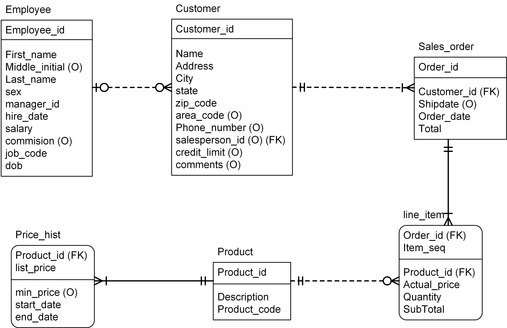
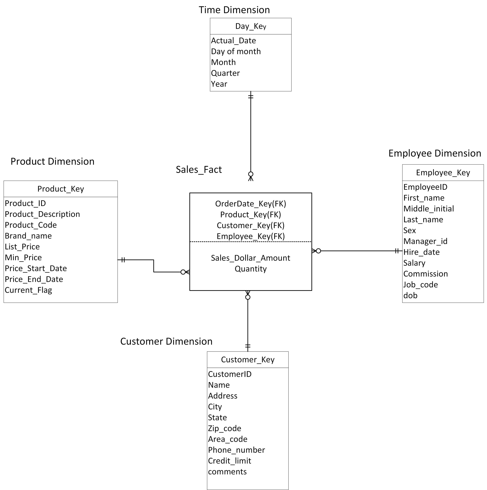

# Build-Star-Schema-in-Data-Warehouse-modeling
In this project, we will create a star schema from an OLTP schema using SQL and PL/SQL.

The general process of the transformation:
* Build the OLTP schema – tables, constraints on primary keys, foreign keys, and others
  * file name: OrderSchema_with_Constraints.txt
* Create dimension tables and one fact table for Star Scheme with all defined constrains, such as primary keys, foreign keys, etc.
  * file name: OrderSchema_Insert.txt
* Use the CREATE SEQUENCE command to create a surrogate key for the dimension tables
* Create the PL/SQL procedure to populate the data for each dimension table
* Execute procedure and check the data
  * file name: hw3-2nd.sql

 

Please give a look about the two schema:

## The OLTP schema:

 

## The Star schema:

